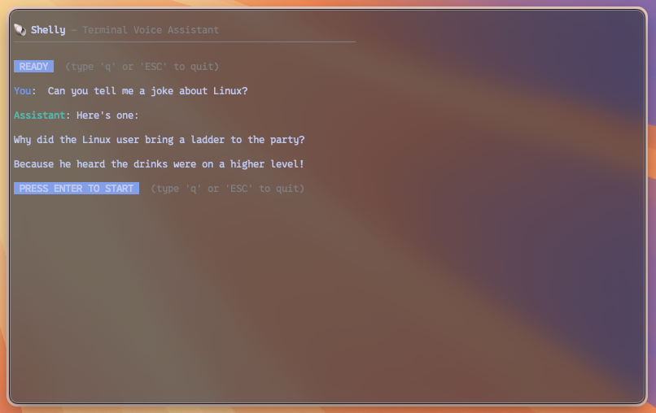

# 🐚 Shelly
## A tiny terminal voice assistant
Shelly is my simple, local “shell Siri.” Press Enter to record, speak, get a streamed reply, and hear it read back. I made it to get back into C++ and to test how easy it is to wire up an AI workflow (Whisper → Ollama LLM → a bit of RAG) in a clean terminal app using C++.




## 🚀 Quick Overview
- Mic recording via PortAudio at 16 kHz
- Offline STT with whisper.cpp (as a subproject)
- Streaming LLM replies from Ollama (libcurl)
- Light text cleanup + sentence buffering for TTS
- TTS using macOS `say` (falls back to `espeak` if available)
- Minimal terminal UI with ANSI helpers

> Note: currently tested on macOS only. The TTS is tailored to macOS’ system `say`.

## 🛠️ Setup & Build
### Prerequisites
- CMake 3.16+, clang/clang++
- Libraries: PortAudio, libsndfile, libcurl
  - macOS (Homebrew): `brew install portaudio libsndfile curl`
  - Linux: install your distro’s -dev packages
- Ollama running locally with a model (e.g., `ollama pull llama3`)

### Build in this repo
```bash
cmake -S . -B build
cmake --build build -j
# run from build folder
./build/shelly
```

### Install (optional)
Install so you can run `shelly` from anywhere:
```bash
# user-local
cmake --install build --prefix ~/.local
# or system-wide (macOS/Linux)
sudo cmake --install build --prefix /usr/local
```

### Whisper models
- Local runs: put `ggml-base.en.bin` into `./models/`
- After install: place models into `<prefix>/share/shelly/models/`
- At runtime, Shelly looks first in the installed share dir, then falls back to `./models/`

See `CMake_Guide.md` for more detailed install layouts and options.

## 💡 Usage
- Start Ollama, then run `shelly`
- Press Enter to start recording, press Enter again to stop
- The answer streams in and is spoken sentence-by-sentence
- Quit anytime with `q` or `Esc` (immediate stop)

## 🧩 Code Map
- `src/main.cpp`: main loop (record → transcribe → prompt → stream → TTS)
- `src/WhisperOffline.cpp`: whisper.cpp wrapper for offline STT
- `src/OllamaClient.cpp`: streaming chat over HTTP with libcurl
- `src/TextPrep.cpp`: markdown/URL cleanup + sentence splitting
- `src/TTS.cpp`: background TTS worker using system `say`

## 🔮 Ideas to Extend
- RAG: grow this into a real retriever (docs, embeddings, reranking)
- Cross‑platform TTS: voices, rates, Windows/Linux backends
- Better mid‑stream interrupt and controls
- Packaging: Homebrew formula, Linux packages, or static linking
- More models/languages: different Whisper models, multilingual, VAD
